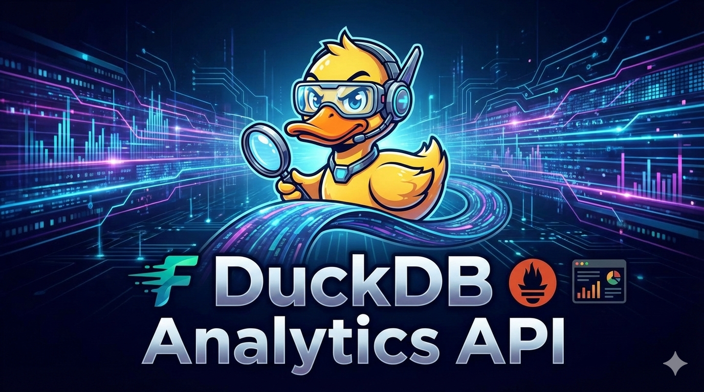
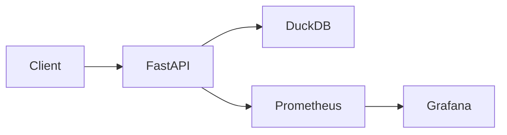
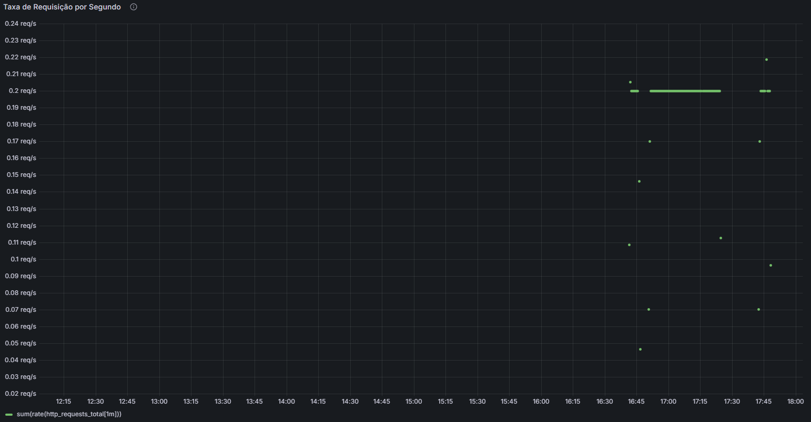
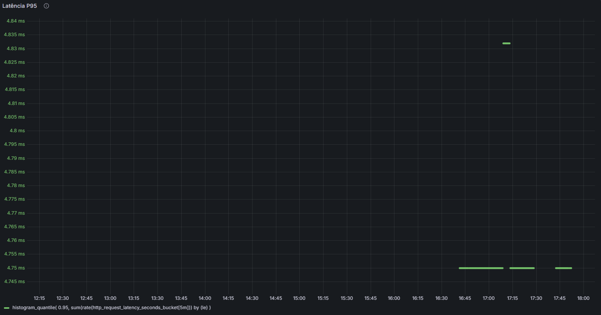

<!-- ===================== -->
<!--        BANNER         -->
<!-- ===================== -->

<p align="center">
  
</p>


<p align="center">
  <b>Embedded Analytics API com FastAPI, DuckDB, Prometheus e Grafana</b><br>
  Projeto focado em performance, observabilidade e boas práticas de engenharia
</p>

---

## 📌 Badges

<p align="center">
  
  
  
  
  
  
  
  
</p>

---

## 🧠 Visão Geral

A **DuckDB Analytics API** é uma API analítica moderna baseada em **Embedded Analytics**, construída para demonstrar:

- Performance analítica com **DuckDB**
- APIs REST modernas com **FastAPI**
- Observabilidade completa com **Prometheus + Grafana**
- Arquitetura limpa e modular
- Testes automatizados (unitários e integração)
- Execução containerizada com **Docker**
- Pipeline de CI com **GitHub Actions**

> 🎯 Projeto ideal como **case de portfólio** para Backend, Data, Platform ou SRE.

---

## 🏗️ Arquitetura

### Visão Geral

```text
Client / Browser
        |
        v
   FastAPI (API)
        |
        ├── Routers
        │   ├── Health
        │   ├── Datasets
        │   ├── Analytics
        │   ├── Queries
        │   └── Metrics (/metrics)
        |
        ├── Services (Business Logic)
        |
        ├── DuckDB (Embedded OLAP Engine)
        |
        └── Prometheus Metrics
                 |
                 v
             Prometheus
                 |
                 v
              Grafana
```

Diagrama (Mermaid)


## 🛠️ Tecnologias Utilizadas

**Linguagens** 
- Python 3.12

**Backend** 
- FastAPI
- Uvicorn
- DuckDB (Embedded Analytics / OLAP)

**Observabilidade** 
- Prometheus
- Grafana
- prometheus-client

**Testes & Qualidade** 
- Pytest
- pytest-cov
- Testes unitários
- Testes de integração

**DevOps & Infra** 
- Docker
- Docker Compose
- GitHub Actions (CI)

---

📂 Estrutura do Projeto
```text
app/
├── api/
│   ├── routes/
│   │   ├── analytics.py
│   │   ├── datasets.py
│   │   ├── health.py
│   │   ├── metrics.py
│   │   └── queries.py
│   └── middlewares/
│       └── request_context.py
├── core/
│   ├── database.py
│   └── logging.py
├── services/
│   ├── analytics_service.py
│   ├── dataset_service.py
│   └── query_service.py
├── schemas/
│   ├── analytics.py
│   ├── dataset.py
│   └── query.py
└── main.py

tests/
├── integration/
└── unit/

docker/
└── Dockerfile

.github/
└── workflows/
    └── python-app.yml
```

---

## 🚀 Como Executar o Projeto

1️⃣ Clonar o repositório

```bash
git clone https://github.com/PabloHSO/duckdb-analytics-api.git
cd duckdb-analytics-api]
```

2️⃣ Subir com Docker
```bash
docker-compose up --build
```

3️⃣ Acessar

- API: http://localhost:8000
- Swagger: http://localhost:8000/docs
- Métricas Prometheus: http://localhost:8000/metrics

## 🧪 Testes & Cobertura
Executar testes localmente:

```bash
pytest --cov=app --cov-report=term-missing
```

✔️ Testes unitários
✔️ Testes de integração
✔️ Cobertura de código

## 📊 Observabilidade
- Métricas expostas
- Total de requisições HTTP
- Requests por endpoint
- Latência das requisições (P95)
- Status codes HTTP

### Exemplos de queries PromQL
```promql
sum(http_requests_total)
```

```promql
histogram_quantile(
  0.95,
  sum(rate(http_request_latency_seconds_bucket[5m])) by (le)
)
```

## 📈 Dashboards Grafana
<!-- ===================== --> <!-- GRAFANA SCREENSHOTS --> <!-- ===================== --> 

<p align="center">  </p> 
<p align="center">  </p>
<p align="center">  </p>
<p align="center">  </p>
<p align="center">  </p>

📌 Os dashboards demonstram tráfego, latência e uso por endpoint em tempo real.

## 🔄 CI/CD
**Pipeline configurado com GitHub Actions:**

- Instala dependências
- Executa testes
- Gera relatório de cobertura

Arquivo:
```text
.github/workflows/python-app.yml
```

## 🎯 Objetivo do Projeto
Este projeto foi desenvolvido para demonstrar:

- Arquitetura backend profissional
- Embedded Analytics com DuckDB
- Observabilidade real (Prometheus + Grafana)
- Testes automatizados
- Práticas modernas de DevOps

👤 Autor
Pablo H. S. O.

- GitHub: https://github.com/PabloHSO
- LinkedIn: https://linkedin.com/in/pablohsilveira